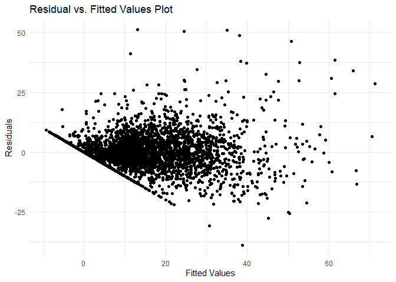

Project proposal
================
Team number 5

- [Environment Setup](#environment-setup)
  - [Load Libraries](#load-libraries)
  - [Read Tables](#read-tables)
    - [Read High-School Budget Table](#read-high-school-budget-table)
    - [Read Lamas Budget Table](#read-lamas-budget-table)
    - [Read Municipal Table](#read-municipal-table)
    - [Read Municipal Budget Table](#read-municipal-budget-table)
    - [Read Municipal Education Image
      Table](#read-municipal-education-image-table)
    - [Read School Aklim Table](#read-school-aklim-table)
    - [Read School Education Image
      Table](#read-school-education-image-table)
    - [Read School Bagrut Table](#read-school-bagrut-table)
- [Data Analyzing](#data-analyzing)
  - [Linear Regression Model](#linear-regression-model)
  - [Plots](#plots)
    - [5 Points Math Entitlement by Pentile and
      District](#5-points-math-entitlement-by-pentile-and-district)
    - [5 Points In Math by Academic
      Leniencies](#5-points-in-math-by-academic-leniencies)
    - [Leniencies](#leniencies)
    - [5 Points In Math by Academic Leniencies (Among Jewish Education,
      2nd
      Pentile)](#5-points-in-math-by-academic-leniencies-among-jewish-education-2nd-pentile)
    - [Distribution of Teachers with Master’s Degree or
      Higher](#distribution-of-teachers-with-masters-degree-or-higher)

# Environment Setup

## Load Libraries

## Read Tables

> **Note**  
> You can download all used data from:
> <https://infocenter.education.gov.il/all/extensions/Shkifut_Reports/Shkifut_Reports.html>.  
> You should than place all that data in the root directory of the
> project under a folder named data.

### Read High-School Budget Table

``` r
high_schools_budget <- read_excel(file_list[1])

names(high_schools_budget) <- c(
    "hebrew_year", "del1", "muni_name", "sid", "school_name", "del13",
    "sector", "pentile", "pentile_type", "del2", "is_new_horizon",
    "teaching_hours", "teaching_cost", "tutor_hours", "del3", "del4", "del5",
    "del6", "tuition", "del7", "del8", "del9", "del10", "students_regular",
    "students_special", "number_of_classes", "number_of_special_classes",
    "del11", "del12", "total_budget"
)

high_schools_budget <- high_schools_budget[, -grep("^del[0-9]+$", names(high_schools_budget))]

high_schools_budget <- high_schools_budget %>%
  mutate(
    year = case_when(
      hebrew_year == "תשפא" ~ 2021,
      hebrew_year == "תשף" ~ 2020,
      hebrew_year == "תשעט" ~ 2019,
      hebrew_year == "תשעח" ~ 2018,
      hebrew_year == "תשעז" ~ 2017,
      hebrew_year == "תשעו" ~ 2016,
      hebrew_year == "תשעה" ~ 2015,
      hebrew_year == "תשעד" ~ 2014,
      TRUE ~ NA_integer_
      ),
    pentile = as.integer(as.character(pentile)),
    pentile_type = case_when(
      pentile_type == "לא מחושב" ~ NA_character_,
      TRUE ~ pentile_type
    ),
    is_new_horizon = case_when(
      is_new_horizon == 1 ~ TRUE,
      TRUE ~ FALSE
    )
  )
```

### Read Lamas Budget Table

``` r
lamas_budget <- read_excel(file_list[2])

names(lamas_budget) <- c(
  "hebrew_year", "socio_economic_status", "del1", "del2", "del3",
  "teaching_hours", "teaching_cost", "tutor_hours", "staying_hours",
  "guidance_hours", "guidance_cost", "del4", "del5", "del6", "del7", "tuition",
  "del8", "perimeter_services_cost", "transportation_cost", "projects_cost",
  "purchases_cost", "del9", "maayan_hinuh_cost", "del10", "ptor_cost",
  "extras_ptor_cost", "number_of_students", "number_of_classes", "del11",
  "del12", "total_budget"
)

lamas_budget <- lamas_budget[, -grep("^del[0-9]+$", names(lamas_budget))]

lamas_budget <- lamas_budget %>%
  mutate(
    year = case_when(
      hebrew_year == "תשפא" ~ 2021,
      hebrew_year == "תשף" ~ 2020,
      hebrew_year == "תשעט" ~ 2019,
      hebrew_year == "תשעח" ~ 2018,
      hebrew_year == "תשעז" ~ 2017,
      hebrew_year == "תשעו" ~ 2016,
      hebrew_year == "תשעה" ~ 2015,
      hebrew_year == "תשעד" ~ 2014,
      TRUE ~ NA_integer_
      ),
    socio_economic_status = as.integer(as.character(socio_economic_status))
    )
```

### Read Municipal Table

``` r
municipal_aklim <- read_excel(file_list[3])

names(municipal_aklim) <- c(
  "mid", "muni_name", "del_edu_level", "hebrew_year", "respondents_teacher",
  "respondents_students", "respondents_teacher_percentage",
  "respondents_students_percentage", "del1", "del2", "del3", "del4", 
  "teacher_student_relations", "del5", "teacher_satisfaction", "del6", "del7",
  "del8", "reception_and_accompaniment", "del9", "violence", "del10",
  "interest", "del11", "teacher_development", "del12", "teaching_methods",
  "del13", "self_teach_strategies", "del14", "del15", "del16",
  "positive_feeling", "del17", "parents_involvement", "del18"
)

municipal_aklim <- municipal_aklim[, -grep("^del[0-9]+$", names(municipal_aklim))]

municipal_aklim <- municipal_aklim %>%
  filter(del_edu_level == 'חט"ע') %>%
  select(-del_edu_level) %>%
  mutate(
    year = case_when(
      hebrew_year == "תשפא" ~ 2021,
      hebrew_year == "תשף" ~ 2020,
      hebrew_year == "תשעט" ~ 2019,
      hebrew_year == "תשעח" ~ 2018,
      hebrew_year == "תשעז" ~ 2017,
      hebrew_year == "תשעו" ~ 2016,
      hebrew_year == "תשעה" ~ 2015,
      hebrew_year == "תשעד" ~ 2014,
      TRUE ~ NA_integer_
      )
  ) %>%
  mutate_all(~ ifelse(. == "-", NA, .))
```

### Read Municipal Budget Table

``` r
municipal_budget <- read_excel(file_list[4])

names(municipal_budget) <- c(
  "hebrew_year", "mid", "district", "muni_name", "socio_economic_status",
  "del1", "del2", "del3", "teaching_hours", "teching_hours_cost", "tutor_hours",
  "staying_hours", "guidance_hours", "guidance_hours_cost", "del4", "del5",
  "del6", "del7", "tuition", "del8", "perimeter_services_cost",
  "transportation_cost", "projects_cost", "purchases_cost", "del9", 
  "maayan_hinuh_cost", "del10", "ptor_cost", "extras_ptor_cost", 
  "number_of_students", "del11", "number_of_classes", "del12","del13", "del13", 
  "del15", "total_budget"
)

municipal_budget <- municipal_budget[, -grep("^del[0-9]+$", names(municipal_budget))]

municipal_budget <- municipal_budget %>%
  mutate(
    year = case_when(
      hebrew_year == "תשפא" ~ 2021,
      hebrew_year == "תשף" ~ 2020,
      hebrew_year == "תשעט" ~ 2019,
      hebrew_year == "תשעח" ~ 2018,
      hebrew_year == "תשעז" ~ 2017,
      hebrew_year == "תשעו" ~ 2016,
      hebrew_year == "תשעה" ~ 2015,
      hebrew_year == "תשעד" ~ 2014,
      TRUE ~ NA_integer_
      )
  ) %>%
  mutate_all(~ ifelse(. == "-", NA, .)) %>%
  mutate(
    across(teaching_hours:total_budget, ~ as.numeric(.x))
  )
```

### Read Municipal Education Image Table

``` r
municipal_edu_image <- read_excel(file_list[5])

names(municipal_edu_image) <- c(
  "hebrew_year", "muni_name", "mid", "socio_economic_status", "district", "del1", 
  "del2", "del3", "del4", "del5", "del6", "high_schools_students", "del7",
  "del8", "del9", "del10", "masters_or_higher_in_high_school", "hatamot_ivchun",
  "hatamot_no_ivchun", "olim", "spcecial_ed_in_reg", "del11", "del12",
  "number_of_classes", "del13", "del14", "del15", "total_teachers", "del16",
  "dropouts", "del17", "del18", "del19", "del20", "bagrut_entitlement",
  "bagrut_reg_ed", "bagrut_excel", "bagrut_reg_ed_excel", "english_4", 
  "english_4_reg_ed", "english_5", "english_5_reg_ed", "math_4", 
  "math_4_reg_ed", "math_5", "math_5_reg_ed", "del21", "del22", "del23",
  "del24", "del25", "del26", "class_size"
  )

municipal_edu_image <- municipal_edu_image[, -grep("^del[0-9]+$", names(municipal_edu_image))]

municipal_edu_image <- municipal_edu_image %>%
  mutate(
    year = case_when(
      hebrew_year == "תשפא" ~ 2021,
      hebrew_year == "תשף" ~ 2020,
      hebrew_year == "תשעט" ~ 2019,
      hebrew_year == "תשעח" ~ 2018,
      hebrew_year == "תשעז" ~ 2017,
      hebrew_year == "תשעו" ~ 2016,
      hebrew_year == "תשעה" ~ 2015,
      hebrew_year == "תשעד" ~ 2014,
      TRUE ~ NA_integer_
      ),
    socio_economic_status = as.integer(as.character(socio_economic_status))
  ) %>%
  mutate_all(~ ifelse(. == "לא רלוונטי", NA, .)) %>%
  mutate_all(~ ifelse(. == "לא מחושב", NA, .))
```

### Read School Aklim Table

``` r
schools_aklim <- read_excel(file_list[6])

names(schools_aklim) <- c(
  "questionaire_year", "district", "sid", "school_name", "del1",
  "del_edu_level", "muni_name", "sector", "type", "respondents_teacher",
  "respondents_students", "respondents_teacher_percentage", 
  "respondents_students_percentage", "del2", "del3", "del4", "del5",
  "teacher_student_relations", "del6", "teacher_satisfaction", "del7", "del8",
  "del9", "reception_and_accompaniment", "del10", "violence", "del11",
  "interest", "del12", "teacher_development", "del13", "teaching_methods",
  "del14", "self_teach_strategies", "del15", "del16", "del17",
  "positive_feeling", "del18", "parents_involvement", "del19", "del20", "del21"
  )

schools_aklim <- schools_aklim[, -grep("^del[0-9]+$", names(schools_aklim))]

schools_aklim <- schools_aklim %>%
  select(-del_edu_level) %>%
  mutate_all(~ ifelse(. == "-", NA, .))
```

### Read School Education Image Table

``` r
schools_edu_image <- read_excel(file_list[8])
names(schools_edu_image) <- c(
  "hebrew_year", "educational_district", "sid", "mid", "muni_name", 
  "school_name", "exam_purity", "del1", "del2", "pentile_middle",
  "pentile_high", "del3", "decile_middle", "decile_high", "sector", "type",
  "from_grade", "to_grade", "school_plan", "tech", "del4", "olim",
  "is_special_ed", "school_type", "number_of_classes",
  "number_of_classes_yod_yodbet", "del5", "del6", "del7", "number_of_students",
  "number_of_students_yod_yodbet", "number_of_students_yodbet",
  "median_seniority", "total_teachers", "masters_or_higher_in_high_school",
  "hatamot_no_ivchun", "del8", "hatamot_ivchun", "del9", "special_ed", "del10",
  "del11", "dropouts", "del12", "del13", "del14", "dropouts_high_school",
  "youth_at_risk", "bagrut_school", "del15", "hila_students"
  )
schools_edu_image <- schools_edu_image[, -grep("^del[0-9\\w]+$", names(schools_edu_image))]
schools_edu_image <- schools_edu_image %>%
  mutate(
    year = case_when(
      hebrew_year == "תשפא" ~ 2021,
      hebrew_year == "תשף" ~ 2020,
      hebrew_year == "תשעט" ~ 2019,
      hebrew_year == "תשעח" ~ 2018,
      hebrew_year == "תשעז" ~ 2017,
      hebrew_year == "תשעו" ~ 2016,
      hebrew_year == "תשעה" ~ 2015,
      hebrew_year == "תשעד" ~ 2014,
      TRUE ~ NA_integer_
      )
  ) %>%
  mutate_all(~ ifelse(. == "לא רלוונטי", NA, .)) %>%
  mutate_all(~ ifelse(. == "לא מחושב", NA, .)) %>%
  mutate(
    tech = as.numeric(tech),
    olim = as.numeric(olim),
    across(number_of_classes:dropouts_high_school, ~ as.numeric(.x)),
    hila_students = as.numeric(hila_students)
  )
```

### Read School Bagrut Table

``` r
schools_bagrut <- read_excel(file_list[7])

names(schools_bagrut) <- c(
  "hebrew_year", "district", "muni_id", "muni_name", "sid", "school_name",
  "exam_purity", "pentile_youth", "sector", "type", "del1", "del2", "del3", "del4",
  "number_of_students_yodbet", "bagrut", "del5", "bagrut_reg_ed", "del6",
  "bagrut_excell", "del7", "bagrut_reg_ed_excell", "del8", "english_4", "del9",
  "english_4_reg_ed", "del10", "english_5", "del11", "english_5_reg_ed",
  "del12", "math_4", "del13", "math_4_reg_ed", "del14", "math_5", "del15",
  "math_5_reg_ed", "del16"
  )

schools_bagrut <- schools_bagrut[, -grep("^del[0-9]+$", names(schools_bagrut))]

schools_bagrut <- schools_bagrut %>%
  mutate(
    year = case_when(
      hebrew_year == "תשפא" ~ 2021,
      hebrew_year == "תשף" ~ 2020,
      hebrew_year == "תשעט" ~ 2019,
      hebrew_year == "תשעח" ~ 2018,
      hebrew_year == "תשעז" ~ 2017,
      hebrew_year == "תשעו" ~ 2016,
      hebrew_year == "תשעה" ~ 2015,
      hebrew_year == "תשעד" ~ 2014,
      TRUE ~ NA_integer_
      ),
    youth_at_risk = case_when(
      pentile_youth == "נוער בסיכון" ~ TRUE,
      TRUE ~ FALSE
    )
  ) %>%
  left_join(schools_edu_image[, c("year", "sid", "pentile_high")], by = c("year", "sid")) %>%
  mutate(pentile = pentile_high) %>%
  select(-pentile_youth, -pentile_high)
  
schools_bagrut <- schools_bagrut %>%
  mutate_all(~ ifelse(. == "לא רלוונטי", NA, .)) %>%
  mutate_all(~ ifelse(. == "לא מחושב", NA, .)) %>%
  mutate(across(number_of_students_yodbet:math_5_reg_ed, ~ as.numeric(.x)))
```

# Data Analyzing

## Linear Regression Model

``` r
# Convert "mid" column to character type in municipal_aklim
municipal_aklim$mid <- as.character(municipal_aklim$mid)

# Perform the join operation
merged_data <- inner_join(schools_bagrut, schools_edu_image, by = c("sid", "year")) %>%
  inner_join(high_schools_budget, by = c("sid", "year")) %>%
  select(-ends_with(".y")) %>%
  select(-c("hebrew_year", "muni_name", "school_name", "sector")) %>%
  rename_with(~ gsub("\\.x$", "", .), ends_with(".x")) %>%
  mutate(
    class_size = number_of_students_yod_yodbet / number_of_classes_yod_yodbet,
    budget_per_student = total_budget / (students_regular + students_special)
  ) %>%
  inner_join(municipal_budget, by = c("mid", "year")) %>%
  inner_join(municipal_aklim, by = c("mid")) %>%
  mutate(
    teacher_student_relations = as.numeric(teacher_student_relations),
    parents_involvement = as.numeric(parents_involvement),
    violence = as.numeric(violence)
  )

# Print the merged dataset with cleaned column names
print(merged_data)
```

    ## # A tibble: 5,512 × 102
    ##    hebrew_year.x district.x muni_id muni_name.x    sid school_name   exam_purity
    ##    <chr>         <chr>      <chr>   <chr>        <dbl> <chr>         <chr>      
    ##  1 תשעו          דרום       315     אופקים      640102 "מוסדות בני … ירוק       
    ##  2 תשעו          דרום       315     אופקים      641001 "אזורי עתיד … ירוק       
    ##  3 תשעו          דרום       315     אופקים      770057 "מדעים ואמנו… ירוק       
    ##  4 תשעו          דרום       703     אשדוד       440487 "ישיבת נוה ה… ירוק       
    ##  5 תשעו          דרום       703     אשדוד       630764 "מרכז נוער ע… ירוק       
    ##  6 תשעו          דרום       703     אשדוד       640128 "מקיף א כללי" ירוק       
    ##  7 תשעו          דרום       703     אשדוד       640136 "מקיף דתי ע\… צהוב       
    ##  8 תשעו          דרום       703     אשדוד       640482 "מקיף ד'"     ירוק       
    ##  9 תשעו          דרום       703     אשדוד       640581 "אולפנא ע\"ש… ירוק       
    ## 10 תשעו          דרום       703     אשדוד       640672 "מקיף ה' כלל… ירוק       
    ## # ℹ 5,502 more rows
    ## # ℹ 95 more variables: sector <chr>, type <chr>,
    ## #   number_of_students_yodbet <dbl>, bagrut <dbl>, bagrut_reg_ed <dbl>,
    ## #   bagrut_excell <dbl>, bagrut_reg_ed_excell <dbl>, english_4 <dbl>,
    ## #   english_4_reg_ed <dbl>, english_5 <dbl>, english_5_reg_ed <dbl>,
    ## #   math_4 <dbl>, math_4_reg_ed <dbl>, math_5 <dbl>, math_5_reg_ed <dbl>,
    ## #   year.x <dbl>, youth_at_risk <lgl>, pentile <chr>, …

``` r
data <- merged_data
```

``` r
# Select the relevant features and target
features <- c(
  'district.x',
  'pentile',
  'sector',
  'type',
  'school_type',
  'tech',
  'class_size',
  'bagrut',
  'masters_or_higher_in_high_school',
  'median_seniority',
  'bagrut_reg_ed',
  'hatamot_ivchun',
  'special_ed',
  'bagrut_excell',
  'bagrut_reg_ed_excell',
  'budget_per_student',
  'teaching_hours.y'
  )

target <- 'math_5_reg_ed'

# Filter the data and handle missing values if needed
filtered_data <- na.omit(data[, c(features, target)])

# Prepare the feature matrix
X <- filtered_data[, setdiff(features, target)]

# Split the dataset into features and target variables
y <- filtered_data[[target]]

# Split the data into training and test sets
set.seed(363)  # For reproducibility
train_indices <- sample(nrow(X), 0.7 * nrow(X))  # 80% for training
train_X <- X[train_indices, ]
train_y <- y[train_indices]
test_X <- X[-train_indices, ]
test_y <- y[-train_indices]

# Fit the linear regression model on the training data
regression_model <- lm(train_y ~ ., data = train_X)

summary(regression_model)
```

    ## 
    ## Call:
    ## lm(formula = train_y ~ ., data = train_X)
    ## 
    ## Residuals:
    ##     Min      1Q  Median      3Q     Max 
    ## -38.832  -4.103  -0.366   3.399  51.132 
    ## 
    ## Coefficients: (1 not defined because of singularities)
    ##                                    Estimate Std. Error t value Pr(>|t|)    
    ## (Intercept)                       1.167e+00  1.703e+00   0.685 0.493123    
    ## district.xחינוך התישבותי         -1.986e+00  6.840e-01  -2.904 0.003710 ** 
    ## district.xחיפה                   -2.153e-01  5.834e-01  -0.369 0.712172    
    ## district.xחרדי                   -6.912e+00  6.785e-01 -10.187  < 2e-16 ***
    ## district.xירושלים                -2.958e+00  6.847e-01  -4.320 1.60e-05 ***
    ## district.xמנח'י                  -4.693e+00  9.020e-01  -5.203 2.07e-07 ***
    ## district.xמרכז                   -1.700e+00  5.709e-01  -2.977 0.002926 ** 
    ## district.xצפון                    1.515e+00  5.478e-01   2.765 0.005725 ** 
    ## district.xתל אביב                -2.218e+00  5.614e-01  -3.951 7.94e-05 ***
    ## pentile2                         -5.175e+00  4.221e-01 -12.262  < 2e-16 ***
    ## pentile3                         -7.058e+00  4.599e-01 -15.345  < 2e-16 ***
    ## pentile4                         -8.418e+00  5.059e-01 -16.639  < 2e-16 ***
    ## pentile5                         -8.778e+00  6.114e-01 -14.356  < 2e-16 ***
    ## sectorדרוזי                       7.823e+00  1.152e+00   6.793 1.27e-11 ***
    ## sectorיהודי                       2.771e+00  7.649e-01   3.622 0.000296 ***
    ## sectorערבי                       -1.021e+00  7.521e-01  -1.357 0.174869    
    ## typeממלכתי                       -5.024e-01  3.465e-01  -1.450 0.147167    
    ## typeממלכתי דתי                           NA         NA      NA       NA    
    ## school_typeישיבה                  5.809e+00  1.124e+00   5.170 2.47e-07 ***
    ## school_typeמושבי                  2.906e+00  1.334e+00   2.179 0.029383 *  
    ## school_typeמפת"ן                  3.611e-01  4.338e+00   0.083 0.933651    
    ## school_typeמרכז חינוך             3.587e-01  1.074e+00   0.334 0.738333    
    ## school_typeקיבוצי                 3.242e+00  1.232e+00   2.631 0.008543 ** 
    ## school_typeרגיל                   1.133e+00  9.031e-01   1.254 0.209874    
    ## school_typeתורני                  3.549e+00  1.926e+00   1.843 0.065475 .  
    ## tech                              2.019e+00  4.037e-01   5.002 5.93e-07 ***
    ## class_size                        7.767e-02  3.103e-02   2.503 0.012355 *  
    ## bagrut                           -6.448e-02  3.317e-02  -1.944 0.051992 .  
    ## masters_or_higher_in_high_school  7.380e+00  1.205e+00   6.122 1.02e-09 ***
    ## median_seniority                  5.718e-02  2.723e-02   2.100 0.035779 *  
    ## bagrut_reg_ed                     1.464e-01  3.258e-02   4.493 7.24e-06 ***
    ## hatamot_ivchun                   -4.600e+00  7.026e-01  -6.547 6.66e-11 ***
    ## special_ed                       -5.863e+00  1.836e+00  -3.194 0.001416 ** 
    ## bagrut_excell                     1.049e+00  1.252e-01   8.375  < 2e-16 ***
    ## bagrut_reg_ed_excell             -4.072e-01  1.197e-01  -3.402 0.000676 ***
    ## budget_per_student               -1.089e-05  1.673e-05  -0.651 0.515111    
    ## teaching_hours.y                  1.949e-05  3.612e-06   5.395 7.29e-08 ***
    ## ---
    ## Signif. codes:  0 '***' 0.001 '**' 0.01 '*' 0.05 '.' 0.1 ' ' 1
    ## 
    ## Residual standard error: 7.229 on 3786 degrees of freedom
    ## Multiple R-squared:  0.7328, Adjusted R-squared:  0.7303 
    ## F-statistic: 296.6 on 35 and 3786 DF,  p-value: < 2.2e-16

``` r
# Diagnostic tests
# 1. Residuals vs. Fitted Values Plot
plot(regression_model$fitted.values, regression_model$residuals, xlab = "Fitted Values", ylab = "Residuals", main = "Residuals vs. Fitted Values Plot")
```

<!-- -->

``` r
# 2. Normal Q-Q Plot of Residuals
{qqnorm(regression_model$residuals, main = "Normal Q-Q Plot of Residuals")
qqline(regression_model$residuals)}
```

<!-- -->

``` r
# 3. Scale-Location Plot
sqrt_abs_residuals <- sqrt(abs(regression_model$residuals))
{plot(regression_model$fitted.values, sqrt_abs_residuals, xlab = "Fitted Values", ylab = "Square Root of Absolute Residuals", main = "Scale-Location Plot")
abline(h = mean(sqrt_abs_residuals), col = "red")}
```

<!-- -->

## Plots

### 5 Points Math Entitlement by Pentile and District

``` r
# Perform the join operation
# Remove duplicate columns and keep only one column with the original name
# Filter data for the years 2020-2021 Drop rows with NA values in pentile or math_5_reg_ed columns
average_scores <- inner_join(schools_bagrut, schools_edu_image, by = c("sid", "year")) %>%
  select(-ends_with(".y")) %>%
  rename_with(~ gsub("\\.x$", "", .), ends_with(".x")) %>%
  filter(year %in% c("2020", "2021"), complete.cases(pentile, math_5_reg_ed)) %>% 
  group_by(pentile, district) %>% # Calculate the average math_5_reg_ed score for each pentile and district
  summarize(average_score = mean(math_5_reg_ed)) %>%
  mutate(district = fct_relevel(district, "צפון", "חיפה", "ירושלים", "דרום", "מנח'י", "חינוך התישבותי", "מרכז", "תל אביב", "חרדי"))

# Plot the average math_5_reg_ed scores
ggplot(average_scores, aes(x = pentile, y = average_score, fill = district)) +
  geom_bar(stat = "identity", position = "dodge", color = "black") +
  geom_vline(aes(xintercept = as.numeric(pentile) + 0.5), color = "black", linetype = "dashed", size = 0.5) +
  labs(x = "Pentile (Nurturing Index)", y = "5 Points Math Entitlement (%)", fill = "District") +
  ggtitle("5 Points Math Entitlement by Pentile and District") +
  theme_bw() +
  theme(plot.title = element_text(hjust = 0.5))
```

    ## Warning: Using `size` aesthetic for lines was deprecated in ggplot2 3.4.0.
    ## ℹ Please use `linewidth` instead.
    ## This warning is displayed once every 8 hours.
    ## Call `lifecycle::last_lifecycle_warnings()` to see where this warning was
    ## generated.

<!-- -->

### 5 Points In Math by Academic Leniencies

``` r
# Perform the join operation
# Remove duplicate columns and keep only one column with the original name
# Filter out rows where hatamot_sum is NA
# Adjust the scales of hatamot_sum and math_5_red_ed to range from 0 to 100
hatamot <- inner_join(schools_bagrut, schools_edu_image, by = c("sid", "year")) %>%
  select(-ends_with(".y")) %>%
  rename_with(~ gsub("\\.x$", "", .), ends_with(".x")) %>%
  drop_na(hatamot_ivchun, hatamot_no_ivchun) %>%
  mutate(
    hatamot_sum = round((hatamot_ivchun + hatamot_no_ivchun) * 100),
    math_5_reg_ed = math_5_reg_ed / 1000
    )

# Create the bar graph
ggplot(hatamot, aes(
  x = cut(hatamot_sum,
          breaks = seq(0, 100, by = 10),
          include.lowest = TRUE,
          labels = c("0-10", "10-20", "20-30", "30-40", "40-50", "50-60", "60-70", "70-80", "80-90", "90-100")
          ),
  y = math_5_reg_ed
  )) +
  geom_bar(stat = "identity", fill = "#00BFC4") +
  labs(x = "Academic Leniencies (With and Without Assessment) (%)",
       y = "5 Points In Math (%)",
       title = "5 Points In Math by Academic Leniencies") +
  theme(plot.title = element_text(hjust = 0.5)) +
  theme(axis.text.x = element_text(angle = 45, hjust = 1)) +
  theme_minimal()
```

<!-- -->

### Leniencies

``` r
# Step 1: Perform an inner join
joined_data <- inner_join(schools_bagrut, schools_edu_image, by = c("sid", "year"))

# Remove duplicate columns and keep only one column with the original name
joined_data <- joined_data %>%
  select(-ends_with(".y")) %>%
  rename_with(~ gsub("\\.x$", "", .), ends_with(".x"))

joined_data$hatamot_sum <- (joined_data$hatamot_ivchun + joined_data$hatamot_no_ivchun)

# Create subsets based on total hatamot threshold
subset1 <- filter(joined_data, hatamot_sum >= 0.7)
subset2 <- filter(joined_data, hatamot_sum < 0.7)

# Calculate proportions for youth_at_risk and pentile within each subset
prop_youth_at_risk_subset1 <- nrow(filter(subset1, youth_at_risk)) / nrow(subset1)
prop_youth_at_risk_subset2 <- nrow(filter(subset2, youth_at_risk)) / nrow(subset2)

# Plot 1: Proportion of youth_at_risk = TRUE
plot1 <- ggplot() +
  geom_bar(data = data.frame(x = c("Leniencies >= 70%", "Leniencies < 70%"),
                             prop = c(prop_youth_at_risk_subset1, prop_youth_at_risk_subset2)),
           aes(x, prop * 100, fill = x), stat = "identity") +
  scale_fill_manual(values = c("#F8766D", "#00BFC4"), guide = FALSE) +
  labs(x = "", y = "Youth at Risk (%)", title = "Proportion of Youth at Risk") +
  scale_y_continuous(limits = c(0, 30)) +
  theme(plot.title = element_text(hjust = 0.5)) +
  theme_minimal()

# Plot 2: Average special_ed
plot2 <- ggplot() +
  geom_bar(data = subset1, aes(x = "Leniencies >= 70%", y = special_ed * 100), stat = "summary", fill = "#00BFC4") +
  geom_bar(data = subset2, aes(x = "Leniencies < 70%", y = special_ed * 100), stat = "summary", fill = "#F8766D") +
  labs(x = "", y = "Special Education (%)", title = "Average Special Education") +
  theme(plot.title = element_text(hjust = 0.5)) +
  theme_minimal()

cowplot::plot_grid(plot1, plot2, nrow = 1)
```

<!-- -->

### 5 Points In Math by Academic Leniencies (Among Jewish Education, 2nd Pentile)

``` r
# Perform the join operation
merged_data <- inner_join(schools_bagrut, schools_edu_image, by = c("sid", "year")) %>%
  inner_join(high_schools_budget, by = c("sid", "year")) %>%
  select(-ends_with(".y")) %>%
  select(-c("hebrew_year", "muni_name", "school_name", "sector")) %>%
  rename_with(~ gsub("\\.x$", "", .), ends_with(".x")) %>%

view(merged_data)

# Perform the join operation
merged_data <- inner_join(schools_bagrut, schools_edu_image, by = c("sid", "year")) %>%
  select(-ends_with(".y")) %>%
  rename_with(~ gsub("\\.x$", "", .), ends_with(".x"))

# Filter the joined dataset based on the given criteria
filtered_high_schools <- merged_data %>%
  filter(pentile_high == "2", sector == "יהודי", year == 2021, type != "חרדי")

# Convert "hatamot_no_ivhun" and "hatamot_ivchun" columns to numeric
filtered_high_schools$hatamot_no_ivchun <- as.numeric(filtered_high_schools$hatamot_no_ivchun)
filtered_high_schools$hatamot_ivchun <- as.numeric(filtered_high_schools$hatamot_ivchun)

# Create a scatter plot
ggplot(filtered_high_schools, aes(x = (hatamot_no_ivchun + hatamot_ivchun)*100, y = math_5_reg_ed)) +
  geom_point() +
  labs(x = "Academic Leniencies (%)", y = "5 Points Math Entitlement (%)", title = "5 Points In Math by Academic Leniencies (Among Jewish Education, 2nd Pentile)") +
  theme(plot.title = element_text(hjust = 0.5))+
  theme_minimal()
```

<!-- -->

### Distribution of Teachers with Master’s Degree or Higher

``` r
# Filter data from schools_edu_image for years 2020-2021 and remove rows with missing values
# Calculate the average masters_or_higher_in_high_school by pentile_high from schools_filtered
average_by_pentile <- schools_edu_image %>%
  filter(year >= 2018 & year <= 2021 & !is.na(pentile_high) & !is.na(masters_or_higher_in_high_school)) %>%
  group_by(pentile_high) %>%
  summarise(average_masters = mean(as.numeric(masters_or_higher_in_high_school)))

# Plot 1: Average masters_or_higher_in_high_school by pentile_high
plot1 <- ggplot(average_by_pentile, aes(pentile_high, average_masters)) +
  geom_bar(stat = "identity", fill = "#00BFC4") +
  labs(x = "Pentile (Nurturing Index)", y = "Masters or Higher (%)", title = "Average Masters or Higher by Pentile (2018-2021)") +
  theme_minimal() +
  theme(plot.title = element_text(size = 8, hjust = 0.5)) +
  scale_y_continuous(labels = function(x) x * 100)

# Filter data from municipal_edu_image for years 2020-2021 and remove rows with missing values
# Calculate the average masters_or_higher_in_high_school by socio_economic_status
average_by_socio_economic <- municipal_edu_image %>%
  filter(year >= 2018 & year <= 2021 & !is.na(socio_economic_status) & !is.na(masters_or_higher_in_high_school)) %>%
  mutate(
    masters_or_higher_in_high_school = as.numeric(masters_or_higher_in_high_school),
    socio_economic_status = factor(socio_economic_status, levels = c(9, 8, 7, 6, 5, 4, 3, 2, 1))
    ) %>%
  group_by(socio_economic_status) %>%
  summarise(average_masters = mean(masters_or_higher_in_high_school, na.rm = TRUE))

# Plot 2: Average masters_or_higher_in_high_school by socio_economic_status
plot2 <- ggplot(average_by_socio_economic, aes(socio_economic_status, average_masters)) +
  geom_bar(stat = "identity", fill = "#F8766D") +
  labs(x = "Socioeconomic Status", y = "Masters or Higher (%)", title = "Average Masters or Higher by Socio-economic Status (2018-2021)") +
  theme_minimal() +
  theme(plot.title = element_text(size = 8, hjust = 0.5)) +
  scale_y_continuous(labels = function(x) x * 100)

# Combine the plots into a single graph
combined_plot <- cowplot::plot_grid(plot1, plot2, nrow = 1)

# Display the combined graph
print(combined_plot)
```

<!-- -->
